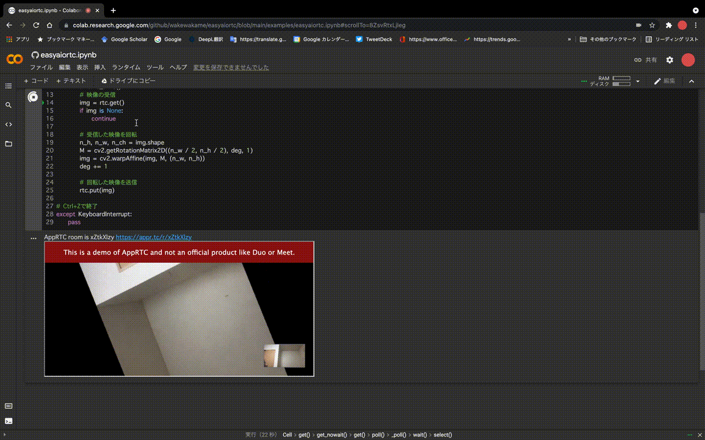

  

# easyaiortc
これはGoogle Colabとの映像通信をリアルタイムに行うためのライブラリです。  
これによりGoogle Colab上での映像のプレビューや、Webカメラからの映像送信が容易になります。  
内部ではaiortcを用いてAppRTC上にルームを作成し、その上で映像の送受信を行なっています。  

# Google Colabで試す

[](https://colab.research.google.com/github/wakewakame/easyaiortc/blob/main/examples/easyaiortc.ipynb)

# 使い方
## 1. ライブラリのインストール

```bash
apt install libavdevice-dev libavfilter-dev libopus-dev libvpx-dev pkg-config
pip install git+https://github.com/wakewakame/easyaiortc.git
```

## 2. Webカメラの映像を回転するサンプルプログラム

```python3
import easyaiortc
import cv2

# 接続の開始
rtc = easyaiortc.EasyAppRTC(preview=True, width=640, height=320)

# 回転角度
deg = 0

try:
    # 接続されている間はループ
    while rtc.is_alive():
        # 映像の受信
        img = rtc.get()
        if img is None:
            continue

        # 受信した映像を回転
        n_h, n_w, n_ch = img.shape
        M = cv2.getRotationMatrix2D((n_w / 2, n_h / 2), deg, 1)
        img = cv2.warpAffine(img, M, (n_w, n_h))
        deg += 1

        # 回転した映像を送信
        rtc.put(img)

# Ctrl+Zで終了
except KeyboardInterrupt:
    pass
```
